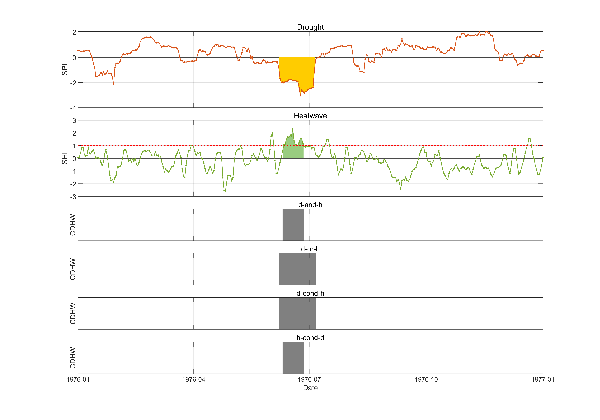

# Compound Drought and Heatwave Events Identification (Python)

[](https://www.python.org/downloads/)
[](https://opensource.org/licenses/MIT)
[](https://doi.org/10.5194/hess-28-2065-2024)

A Python implementation for identifying drought, heatwave, and compound drought-heatwave events on a daily scale across all seasons. This package provides a complete workflow from raw climate data to event identification using standardized indices and advanced statistical methods in HESS paper [](https://doi.org/10.5194/hess-28-2065-2024).

You can still find the MATLAB codes in ./Matlab_version. I would like to thank the 23 people voting, which gives me the motivation to develop.


<p align="center">
  
</p>

## 🌟 Features

- **🔥 Main Entry Functions**
  - `identify_compound_events`: Complete workflow for compound drought-heatwave event identification
  - `identify_extremes`: Single-variable extreme event identification (drought, heatwave, pluvial, or coldwave)

- **📊 Standardized Indices**
  - Support for both stationary and non-stationary approaches
  - Mann-Kendall trend test for non-stationarity detection
  - `SI_nonparametric`: Non-parametric method based on empirical distribution (Gringorten plotting position)
  - `SI_best_distribution`: Parametric method with automatic distribution selection (10 distributions), time consuming


- **🎯 Event Identification**
  - **PRM algorithm**: Pre-identification, Removal, and Merging
  - Statistical validation (inter-arrival time ~ exponential, severity ~ GEV)
  - Automatic threshold optimization via grid search
  - Four compound event types: AND, OR, conditional combinations

- **📈 Data Processing**
  - Leap year normalization
  - Multi-scale temporal aggregation
  - Support for pandas DataFrame/Series and xarray DataArray/Dataset


## 📦 Installation

### Install from source (recommended for development)

```bash
# Clone the repository
git clone https://github.com/BaoyingShan0/Compound-drought-and-heatwave-events-identification.git
cd Compound-drought-and-heatwave-events-identification

# Install in editable mode with all dependencies
pip install -e .

# Or install with optional dependencies for full functionality
pip install -e ".[full]"
```


### Requirements

**Core dependencies:**
- Python >= 3.9
- numpy >= 1.24
- pandas >= 1.5
- scipy >= 1.10
- matplotlib >= 3.7

**Optional dependencies (recommended):**
- pymannkendall >= 1.4 (for trend detection)
- numba >= 0.58 (for performance optimization)
- xarray >= 2023.7 (for multi-dimensional data support)
- bottleneck >= 1.3 (for faster rolling operations)

## 🚀 Quick Start

### Simple Example: Compound Drought and Heatwave Events

```python
from Shan_daily import identify_compound_events
import pandas as pd

# Load daily precipitation and temperature data
# Use example data from the repository
pre_daily = pd.read_csv("examples/data/daily_pre.csv")  # columns: date, pre
tem_daily = pd.read_csv("examples/data/tem_daily.csv")  # columns: date, tem_mean

# Identify compound drought-heatwave events
result = identify_compound_events(
    pre_daily=pre_daily,
    tem_daily=tem_daily,
    scale_pre=30,           # 30-day SPI
    scale_tem=3,            # 3-day SHI
    nsp=30,                 # 30-year non-stationary window
    si_method="nonparametric",
    compound_type=1,        # 1: AND (intersection)
)

# Access results
drought_events = result['drought_events']        # Event summary table
heatwave_events = result['heatwave_events']      # Event summary table
compound_daily = result['compound_daily']        # Daily compound flags
print(f"Found {len(drought_events)} drought events")
print(f"Found {len(heatwave_events)} heatwave events")
print(f"Found {compound_daily['is_compound'].sum()} compound days")
```

### Single Variable Example: Drought Only

```python
from Shan_daily import identify_extremes

# Identify drought events
result = identify_extremes(
    climate_daily=pre_daily,
    extreme_type="d",       # "d" for drought, "h" for heatwave, "p" for pluvial, "c" for coldwave
    scale=30,
    group_by="sum",         # "sum" for precipitation, "mean" for temperature
    si_method="nonparametric",
)

events = result['extreme_events']
print(events.head())
```

### Visualization

```python
from Shan_daily import plot_extremes_identification

# Plot drought identification results
plot_extremes_identification(
    extreme_daily_all=result['drought_daily'].iloc[0:365*2],  # First two years
    start_th=-1.0,
    extreme_type="d",
    save_path="drought_identification.png"
)
```

## 📖 Detailed Usage

### 1. Using Your Own Data

To use your own climate data (A continuous n-year daily time series), prepare CSV files with the following format:

```python
# Your data should have columns: date, variable_name
# Example structure:
#   date        | pre
#   1900-01-01  | 5.2
#   1900-01-02  | 0.0
#   ...
#   1950-12-31  | 0.2

import pandas as pd

# Load your own data
pre_daily = pd.read_csv("path/to/your/precipitation.csv")
tem_daily = pd.read_csv("path/to/your/temperature.csv")
```

### 2. Data Preprocessing

```python
from Shan_daily import to_365

# Normalize leap year data to 365 days
pre_365 = to_365(pre_daily, how="sum")    # Sum for precipitation
tem_365 = to_365(tem_daily, how="mean")   # Mean for temperature
```

### 3. Compute Standardized Indices

```python
from Shan_daily import SI_nonparametric, SI_best_distribution

# Non-parametric method (faster, recommended)
spi = SI_nonparametric(
    pre_365['pre'], 
    scale=30, 
    group_by='sum', 
    NSP=30,                    # 30-year window for non-stationarity
    pp_method='gringorten'     # or 'weibull'
)

# Parametric method (slower, more flexible)
spi_best = SI_best_distribution(
    pre_365['pre'],
    scale=30,
    group_by='sum',
    NSP=30,
    distributions=["norm", "gamma", "genextreme", "burr"]
)
```

### 4. Advanced: Manual Threshold Optimization

```python
from Shan_daily import remo_merg, PRM_extreme_identification, daily_2_events

# Step 1: Find optimal thresholds
thresholds = remo_merg(
    "d",                              # "d" for drought, "h" for heatwave
    spi,
    scale=30,
    start_th=-1.0,
    end_th=-1.0,
    events_number_control=0.1,        # Min events per year
    events_days_control=120.0,        # Max event days per year
)

# Step 2: Identify events with optimal thresholds
removal_th = thresholds.iloc[0]['removal_threshold']
merging_th = thresholds.iloc[0]['merging_threshold']

_, drought_daily = PRM_extreme_identification(
    "d", spi, 
    start_th=-1.0, 
    end_th=-1.0,
    REMO=removal_th,
    MERG=merging_th
)

# Step 3: Convert to event summary
drought_events = daily_2_events(drought_daily, "d")
```

### 5. Compound Event Types

```python
from Shan_daily import identify_compound

# Type 1: Intersection (drought AND heatwave)
compound_flags, compound_daily = identify_compound(
    drought_daily, heatwave_daily, type=1
)

# Type 2: Union (drought OR heatwave)
compound_flags, compound_daily = identify_compound(
    drought_daily, heatwave_daily, type=2
)

# Type 3: Drought-conditional-heatwave
compound_flags, compound_daily = identify_compound(
    drought_daily, heatwave_daily, type=3
)

# Type 4: Heatwave-conditional-drought
compound_flags, compound_daily = identify_compound(
    drought_daily, heatwave_daily, type=4
)
```

## 📊 Output Structure

### Event Summary Table

Each event is characterized by:

| Column | Description |
|--------|-------------|
| `num` | Event number (starting from 1) |
| `duration` | Event duration (days) |
| `severity` | Sum of SI values during the event |
| `intensity` | Average SI value during the event |
| `neighbor_duration` | Days between current and previous event |
| `inter_arrival` | Duration + neighbor_duration |

### Compound Event Output

- `compound_flags`: DataFrame with `is_compound` (0/1) and `compound_order` columns
- `compound_daily`: Detailed daily information including SI values for both extremes

## 🔬 Methodology

This implementation follows the methodology described in:

> Shan, B., Verhoest, N. E. C., and De Baets, B.: **Identification of compound drought and heatwave events on a daily scale and across four seasons**, *Hydrol. Earth Syst. Sci.*, 28, 2065–2080, https://doi.org/10.5194/hess-28-2065-2024, 2024.
>
> 

## 📁 Project Structure

```
Compound-drought-and-heatwave-events-identification/
├── src/
│   └── Shan_daily/                      # Main package
│       ├── __init__.py                  # Package exports
│       ├── pipeline.py                  # Main entry functions
│       ├── compound4types.py            # Compound event logic
│       ├── SI_nonparametric.py          # Non-parametric SI computation
│       ├── SI_best_distribution.py      # Parametric SI with auto-fitting
│       ├── PRM_extreme_identification.py # PRM algorithm
│       ├── remo_merg.py                 # Threshold optimization
│       ├── daily_2_events.py            # Event summarization
│       ├── to_365.py                    # Leap year normalization
│       ├── proximity.py                 # Inter-event proximity analysis
│       ├── meet_two_assumption_or_not.py # Statistical validation tests
│       └── plot_extremes_identification.py # Visualization tools
│
├── tests/                               # Test suite
│
├── examples/                            # Usage examples
│   ├── run_demo.py                      # Comprehensive demo script
│   ├── data/                            # Example datasets
│   │   ├── daily_pre.csv                # Sample precipitation data
│   │   └── tem_daily.csv                # Sample temperature data
│   └── README.md                        # Examples documentation
│
├── Matlab_version/                      # Original MATLAB code
│   ├── 01_data/                         # MATLAB data files
│   ├── 02_src/                          # MATLAB source code
│   ├── main.m                           # MATLAB main script
│   └── README.md                        # MATLAB version info
│
├── LICENSE                              # MIT License
├── README.md                            # This file (main documentation)
├── CHANGELOG.md                         # Version history
├── CONTRIBUTING.md                      # Contribution guidelines
├── PROJECT_STATUS.md                    # Project improvement report
│
├── pyproject.toml                       # Package configuration (PEP 518)
├── requirements.txt                     # Python dependencies
├── environment.yml                      # Conda environment specification
│
├── .gitignore                           # Git ignore patterns
└── .gitattributes                       # Git attributes for line endings
```

## 🤝 Contributing

Contributions are welcome! Please feel free to submit a Pull Request. For major changes, please open an issue first to discuss what you would like to change.

## 📝 Citation

If you use this package in your research, please cite:

```bibtex
@article{shan2024identification,
  title={Identification of compound drought and heatwave events on a daily scale and across four seasons},
  author={Shan, Baoying and Verhoest, Niko EC and De Baets, Bernard},
  journal={Hydrology and Earth System Sciences},
  volume={28},
  pages={2065--2080},
  year={2024},
  publisher={Copernicus Publications G{\"o}ttingen, Germany},
  doi={10.5194/hess-28-2065-2024}
}
```

## 📧 Contact

- **Author**: Baoying Shan
- **Email**: baoying.shan@polimi.it

For questions, bug reports, or feature requests, please open an issue on GitHub or contact the author directly.


## 📜 License

This project is licensed under the MIT License - see the [LICENSE](LICENSE) file for details.


## 🔗 Related Resources

- **Original Paper**: https://doi.org/10.5194/hess-28-2065-2024
- **MATLAB Version**: See `Matlab_version/` directory
- **Issue Tracker**: https://github.com/BaoyingShan0/Compound-drought-and-heatwave-events-identification/issues

---

⭐ **If you find this package useful, please consider giving it a star on GitHub!** ⭐

